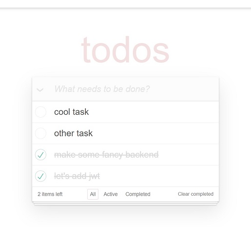

# Task Manager

Simple Task Manager built using React. It allows users to manage their tasks efficiently.

This is a frontend for a [Todo Server](https://github.com/danielpopek94/todos_backend/). It provides an API to manage todos with basic CRUD operations.


## Technologies Used

- React.js
- Node.js
- Express.js
- MongoDB (Atlas)
- JWT
- Nodemon
- Cors
- Body Parser

## Getting Started

To get started with the Task Manager, follow these simple steps:

1. Clone this repository to your local machine using the following command:

   ```
   git clone https://github.com/danielpopek94/task_manager.git
   ```

2. Navigate to the project directory:

   ```
   cd task-manager
   ```

3. Install the required dependencies:

   ```
   npm install
   ```

4. Start the development server:

   ```
   npm start
   ```

   This will run the app in development mode and open it in your default web browser at [http://localhost:3000](http://localhost:3000).

## Default Login

To make it easy for users to get started, I have provided default login credentials.

You can use these credentials to log in and explore the Todo App without the need to create a new account.

## Features

- Add new tasks to your to-do list.
- Mark tasks as completed.
- Delete tasks when you no longer need them.
- Easily manage your tasks and stay organized.

## License

This project is licensed under the [MIT License](LICENSE).

## Learn More

For more information about Create React App and React, you can refer to the following resources:

- [Create React App documentation](https://facebook.github.io/create-react-app/docs/getting-started)
- [React documentation](https://reactjs.org/)

Enjoy using the Todo App!
